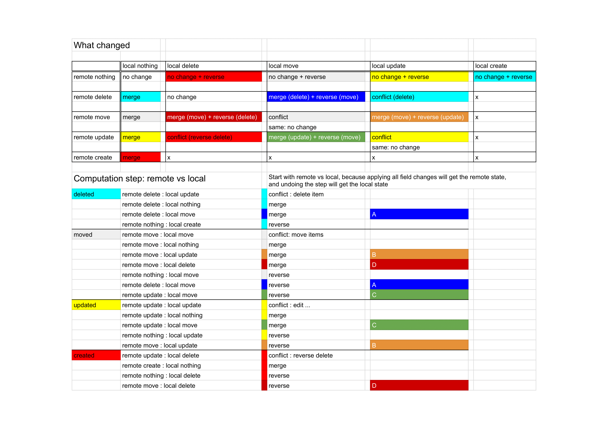

# Edit History

* [Key concepts](#key-concepts)
  + [Version Token](#version-token)
  + [Path](#path)
  + [Field Change](#field-change)
  + [Combined Field Change](#combined-field-change)
  + [Grouped Field Changes](#grouped-field-changes)
  + [Step](#step)
  + [Operation](#operation)
  + [Conflict](#conflict)
  + [Related Change](#related-change)
  + [Edit Steps](#edit-steps)
  + [Refreshed Step](#refreshed-step)
  + [Use of immer](#use-of-immer)
* [Concurrency handling](#concurrency-handling)
  + [Example: merge changes](#example--merge-changes)
  + [Example: merge changes with conflict resolution](#example--merge-changes-with-conflict-resolution)
  + [Example: discard local changes](#example--discard-local-changes)
  + [Example: use local](#example--use-local)
* [Edit patterns](#edit-patterns)

## Key concepts

### Version Token
Token for a specific version. If data is saved, version token changes, therefore can detect change by comparing the version tokens.

### Path
Json Pointer-like, starts with `/`. e.g. `/who`.

### Field Change

Records a change of value in path's location.
Can undo and redo each field change.

### Combined Field Change
If a field's value changes consecutively, the changes will be counted as one field change. It is implemented by combining the new change with the last field change. `combineFieldChanges`

### Grouped Field Changes
Field changes of different paths, that are inseparable. The changes will be in the same `Operation`, undo or redo together, and apply or unapply together.

### Operation
```
{
  type: 'edit' | 'merge' | 'conflict' | 'reverse local'
  fieldChanges
  conflictName?
  conflictApplied?
  applied
}
```

An `Operation` conatins one or more field changes. If an operation contains more than one field change, the field changes are inseparable.

### Step
```
{
  name
  operations
  versionToken?
  mergeBehaviour?: 'merge' | 'discard local changes'
  saveStatus?: 'saving' | 'saved'
}
```

Operartions in a step are ordered.

`saveStatus` shows that the formData at that step is saved by the user, and that step will not merge with later changes. `saveStatus` is not reliable, and is intended only for giving the user a hint.

#### Edit Step
An edit step will have only one operation, that operation can have one or more field changes. (* need to verify, will this work with throttled middleware?)

#### Refreshed Step
If a step has `versionToken`, the step is a "Refreshed" step. `mergeBehaviour` can either be `merge` or `discard local changes`.

When `mergeBehaviour` is `merge`, operations with type `merge`, and `conflict` with `conflictApplied=true` are applied, operations with type `reverse local` are not applied.

When `mergeBehaviour` is `discard local changes`, all operation types `merge`, `conflict` and `reverse local` are applied. The result formData will be the remote's formData.

If there are no local changes, the default merge behaviour will be `discard local changes`.\
If there are local changes, the default merge behaviour will be `merge`.

A refreshed step can one or many operations.

### Conflict
A conflict is a special kind of Operation. It has a name, similar to step name. It contains one or more field changes. When the step's `mergeBehaviour` is `merge`, the user can choose to apply or unapply the conflict with a checkbox. Apply a conflict means take remote version of the data, unapply means take the local version.

When the field(or related fields) are edited after the "Refreshed" step, the checkbox to apply or unapply a conflict will be disabled.

### Related Change
A conflict's apply or reapply will be disabled when there is a change that relates to any of the conflict's field changes.

### Edit Step
All Redux Actions that chould change formData will have editHistory middleware calculate the step. See `editStep.ts`.

### Refreshed Step
For action `setActivityFromAppStore`, the App's formData might merge with the local formData with a step named `Refreshed`. See `refreshedStep.ts`.

### Use of immer
`undoFieldChange` and `redoFieldChange` uses immer to calculate new formData. `produce` is called for each field change, because there can be replacements of an object properties (collection add) and the new part is not drafted.
"Data not originating from the state will never be drafted"

Immer allows nested produce, note that the form data input might be a draft (from create reducer).

## Concurrency handling

### Example: merge changes
When user click refresh or try to save, but there is remote changes, a new 'Refershed' step might be added, and the remote's form data is merged with the local changes. e.g.


### Example: merge changes with conflict resolution
Choose to apply or unapply a conflict with the checkbox.
Manually edit if neither remote or local is wanted.


### Example: discard local changes
Choose to use the entire remote form data with 'Discard local changes' option.


### Example: use local
Choose to use the entire local form data by undoing the refreshed step.


## Edit patterns
Check `editHistory.test.js`
- Edit field
- Remove item from collection
- Move items in collection
- Edit collection's item's field
- Add item to collection
- Procedure's machine id

Refresh Collection Operations


## Test
For each edit pattern, test:
1. Edit
2. Combine edits: consecutive edits combine into one field change and one step
3. Undo/Redo
5. Local Edit: when refresh, local edit will not be overriden by unrelated remote changes
    1. Can undo/redo the refreshed step
6. Remote Edit: when refresh, remote edit will be merged(applied to form data)
    1. Can undo/redo the refreshed step
7. Same Edits: when refresh, local and remote could have made the same edit
8. Conflicting Edits: when local and remote have conflicting edits, for each conflict type:
    1. Unapply the conflict operation
        1. Undo/redo the refreshed step
    2. Reapply the conflict operation
        1. Undo/redo the refreshed step
    3. After the refreshed step, for each type of related change:
        1. a related change will cause conflictHasRelatedChanges to be true
        2. undo the related change will cause conflictHasRelatedChanges to be false
    4. (optional) Unrelated changes will not change conflictHasRelatedChanges

Note: different local and remote edit combinations will create different Local Edit, Remote Edit, Same Edits and Conflicting Edits operations.\
E.g. a collection's item add/update/remove/move, the tests are organized to show the different combinations.

In Short
```
edit
combine
undo redo
Local Edit
Remote Edit
Same Edits
Conflicting Edits
- Unapply Reapply Undo/redo
- Related change + Undo
```